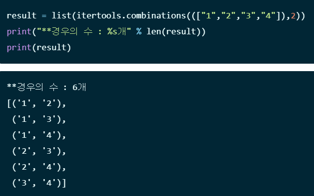

# [치킨 배달](https://www.acmicpc.net/problem/15686)

## 문제 설명

- 치킨 거리 : 집과 가장 가까운 치킨집 사이의 거리
    - 각각의 집은 치킨거리를 가진다
    - 도시의 치킨거리 = 모든 집의 치킨거리의 합

- 임의의 두 칸 (r1, c1)과 (r2, c2) 사이의 거리는 |r1-r2| + |c1-c2|로 구한다
- 0 은 빈칸, 1은 집, 2는 치킨집

- 도시의 치킨거리가 가장 작게되도록 몇개의 치킨집을 폐업시켜야 한다.

## 아이디어

- 모든 경우의 수로 치킨집을 골라 그에 해당하는 도시의 치킨 거리를 구한다.

## 코드

### 4차시도([성공](https://www.acmicpc.net/status?user_id=guswns3371&problem_id=15686&from_mine=1))

```python
import itertools


def distance(a, b):
    return abs(a[0] - b[0]) + abs(a[1] - b[1])


n, m = map(int, input().split())
city = []
house = []
chicken_house = []
# chick_dist[i] : [chicken[i] 와 집 사이의 거리..] 정보의 배열
chick_dist = []
INF = int(1e9)

# 도시 정보 입력
for _ in range(n):
    city.append(list(map(int, input().split())))

# 집과 치킨 집 정보 입력
for i in range(n):
    for j in range(n):
        if city[i][j] == 1:
            house.append([i + 1, j + 1])
        elif city[i][j] == 2:
            chicken_house.append([i + 1, j + 1])

# 전체 치킨집 중 m개의 치킨집을 선택하는 경우의 수 구하기
# temp_list = [0,1,2,.] : 각 숫자는 치킨집의 인덱스
temp_list = [i for i in range(len(chicken_house))]
combination = list(itertools.combinations(temp_list, m))
c_list = []
# combination에 tuple이 담기므로 list로 변환
for comb in combination:
    c_list.append(list(comb))

# 각 치킨집마다 모든 집과의 거리
for c in chicken_house:
    dist = []
    for h in house:
        dist.append(distance(h, c))
    chick_dist.append(dist)

# 서로다른 m개의 치킨집을 골라 도시의 치킨 거리 구하기
min_dist = [INF for _ in range(len(house))]
for i in range(len(c_list)):
    temp_dist = [INF for _ in range(len(house))]
    for j in c_list[i]:
        for k in range(len(house)):
            temp_dist[k] = min(temp_dist[k], chick_dist[j][k])
    if sum(temp_dist) < sum(min_dist):
        min_dist = temp_dist

print(sum(min_dist))
```

#### 설명

- 예시

```
5 2
0 2 0 1 0
1 0 1 0 0
0 0 0 0 0
2 0 0 1 1
2 2 0 1 2
```

|인덱스|치킨집(chicken_house)|거리(chick_dist)|
|---|---|---|
|0|[1, 2]|[2, 2, 2, 5, 6, 6]|
|1|[4, 1]|[6, 2, 4, 3, 4, 4]|
|2|[5, 1]|[7, 3, 5, 4, 5, 3]|
|3|[5, 2]|[6, 4, 4, 3, 4, 2]|
|4|[5, 5]|[5, 7, 5, 2, 1, 1]|

- 여기서 치킨집[1,2]의 거리 [2, 2, 2, 5, 6, 6]의 의미

|인덱스|거리값|의미|
|---|---|---|
|0|2|house[0]과 치킨집[1,2]의 거리|
|1|2|house[1]과 치킨집[1,2]의 거리|
|2|2|house[2]과 치킨집[1,2]의 거리|
|3|5|house[3]과 치킨집[1,2]의 거리|
|4|6|house[4]과 치킨집[1,2]의 거리|
|5|6|house[5]과 치킨집[1,2]의 거리|

- 경우의 수(c_list)로 반복문을 실행한다.

      [[0, 1], [0, 2], [0, 3], [0, 4], [1, 2], [1, 3], [1, 4], [2, 3], [2, 4], [3, 4]]

>- [0,1] : chicken_house[0] 과 chicken_house[1]의 거리를 비교
>    - 다시말해, [2, 2, 2, 5, 6, 6] 와 [6, 2, 4, 3, 4, 4] 를 비교한다
>    - 비교한 결과를 temp_dist에 담는다
>
>|chicken_house[0]|[2, 2, 2, 5, 6, 6]|
>|---|---|
>|chicken_house[1]|[6, 2, 4, 3, 4, 4]|
>|비교||
>|결과(temp_dist)|[2, 2, 2, 3, 4, 4]|
>
> - mid_dist를 갱신조건
>```python
>if sum(temp_dist) < sum(min_dist):
>    min_dist = temp_dist
>```
>
- 이 과정을 반복 수행하면 min_dist에 최소의 도시의 치킨 거리가 담긴다 


- [경우의 수](https://yganalyst.github.io/etc/memo_18_itertools/)



## [모범 답안](https://github.com/ndb796/python-for-coding-test/blob/master/12/7.py)

```python
from itertools import combinations

n, m = map(int, input().split())
chicken, house = [], []

for r in range(n):
  data = list(map(int, input().split()))
  for c in range(n):
    if data[c] == 1:
      house.append((r, c))  # 일반 집
    elif data[c] == 2:
      chicken.append((r, c))  # 치킨집

# 모든 치킨 집 중에서 m개의 치킨 집을 뽑는 조합 계산
candidates = list(combinations(chicken, m))


# 치킨 거리의 합을 계산하는 함수
def get_sum(candidate):
  result = 0
  # 모든 집에 대하여
  for hx, hy in house:
    # 가장 가까운 치킨 집을 찾기
    temp = 1e9
    for cx, cy in candidate:
      temp = min(temp, abs(hx - cx) + abs(hy - cy))
    # 가장 가까운 치킨 집까지의 거리를 더하기
    result += temp
  # 치킨 거리의 합 반환
  return result


# 치킨 거리의 합의 최소를 찾아 출력
result = 1e9
for candidate in candidates:
  result = min(result, get_sum(candidate))

print(result)
```