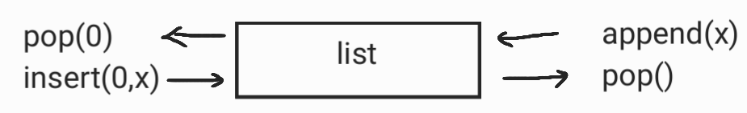
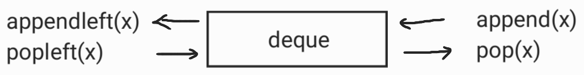

# [특정 거리의 도시 찾기](https://www.acmicpc.net/problem/18352)

## 문제 설명

- 도시 1 ~ N번과 단방행 도로 M개가 존재. 도로의 거리는 모두 1이다.

- 특정 도시 X로부터 출발하여 도달할 수 있는 모든 도시중, 최단 거리가 K인 모든 도시의 번호를 출력하기
    * 출발 도시 X에서 출발 도시 X로 가는 최단 거리 = 0

## 아이디어

* 도시 X로부터 최단거리가 K인 모든 노드를 구해야 한다
    * 여기서 포인트는 모든 노드! => BFS를 사용한다

> 1. 탐색 시작 노드를 큐에 삽입하고 방문처리를 한다
> 2. 큐에서 노드를 꺼내 해당 노드의 인접 노드중 방문하지 않은 노드를 모두 큐에 삽입하고, 방문처리한다
> 3. 최단 거리가 K가 될때까지만 2번을 반복한다.

## Pseudo-code

```

```

## 코드

### 1차시도(실패)

```python
from collections import deque
from sys import stdin

n, m, k, x = map(int, stdin.readline().split())
graph = [[] for _ in range(n + 1)]
# 시작 노드로부터 거리를 저장하는 리스트
distance = [0] * (n + 1)
visited = [False] * (n + 1)
result = []

for _ in range(m):
    a, b = map(int, stdin.readline().split())
    graph[a].append(b)

for _ in range(m):
    a, b = map(int, input().split())
    graph[a].append(b)


def bfs(graph, start, visited):
    # 큐에 start노드 삽입
    queue = deque([start])
    # 방문처리
    visited[start] = True
    while queue:
        now = queue.pop()
        for i in graph[now]:
            if not visited[i]:
                queue.append(i)
                # 현재 방문 노드 now와 연결된 노드i의 거리를 갱신한다.
                distance[i] = distance[now] + 1
                visited[i] = True


bfs(graph, x, visited)
if k not in distance:
    print(-1)
else:
    for i in range(len(distance)):
        if distance[i] == k:
            print(i)
```

#### 설명

* distance 리스트는 출발 도시 X로부터 떨어진 거리를 저장한다.
    * ```
      distance[i] = distance[now] + 1
      ```

#### 틀린 이유

* python으로 실행하면 "시간초과", pypy3로 실행하면 "틀렸습니다" => 답도 잘못되었고, 시간복잡도도 쓰레기수준
    * 출발 도시 X로부터 현재 방문한 도시까지의 거리가 k보다 큰경우는 계산하지 않는다.


* 간과한 조건 : 출발 도시 X애서 출발 도시 X로 가는 최단 거리는 항상 0 이다.

### n차시도([성공](https://www.acmicpc.net/status?from_mine=1&problem_id=18352&user_id=guswns3371))

```python
from collections import deque
import sys

input = sys.stdin.readline


def bfs(graph, start, visited):
    # 큐에 start노드 삽입
    queue = deque([start])
    # 방문처리
    visited[start] = True
    distance[start] = 0

    while queue:
        now = queue.popleft()
        for i in graph[now]:
            if not visited[i]:
                queue.append(i)
                visited[i] = True
                distance[i] = min(distance[i], distance[now] + 1)


n, m, k, x = map(int, input().split())
graph = [[] for _ in range(n + 1)]
# 시작 노드로부터 거리를 저장하는 리스트
distance = [int(1e9)] * (n + 1)
visited = [False] * (n + 1)

for _ in range(m):
    a, b = map(int, input().split())
    graph[a].append(b)

bfs(graph, x, visited)

# 최단 거리가 k인 도시 번호 탐색
flag = True
for d in range(len(distance)):
    if distance[d] == k:
        print(d)
        flag = False

if flag:
    print(-1)

```

#### 설명

* 여태 틀렸던 이유가 deque 자료구조를 제대로 알지 못했기 때문이다.
    *
  ```python
  now = queue.pop() [1차 시도]
  now = queue.popleft() [n차 시도]
  ```

* list
     

* deque (double-ended queue)
     
  

* "출발 도시 X에서 출발 도시 X로 가는 최단 거리는 항상 0 이다." 조건을 따로 고려할 필요없다
  * if not visited[i] 조건에 의해 도착지가 출발 도시 X인 경우를 건너뛸 수 있다. 

## [모범 답안](https://github.com/ndb796/python-for-coding-test/blob/master/13/1.py)

```python
from collections import deque

# 도시의 개수, 도로의 개수, 거리 정보, 출발 도시 번호
n, m, k, x = map(int, input().split())
graph = [[] for _ in range(n + 1)]

# 모든 도로 정보 입력 받기
for _ in range(m):
    a, b = map(int, input().split())
    graph[a].append(b)

# 모든 도시에 대한 최단 거리 초기화
distance = [-1] * (n + 1)
distance[x] = 0 # 출발 도시까지의 거리는 0으로 설정

# 너비 우선 탐색(BFS) 수행
q = deque([x])
while q:
    now = q.popleft()
    # 현재 도시에서 이동할 수 있는 모든 도시를 확인
    for next_node in graph[now]:
        # 아직 방문하지 않은 도시라면
        if distance[next_node] == -1:
            # 최단 거리 갱신
            distance[next_node] = distance[now] + 1
            q.append(next_node)

# 최단 거리가 K인 모든 도시의 번호를 오름차순으로 출력
check = False
for i in range(1, n + 1):
    if distance[i] == k:
        print(i)
        check = True

# 만약 최단 거리가 K인 도시가 없다면, -1 출력
if check == False:
    print(-1)
```