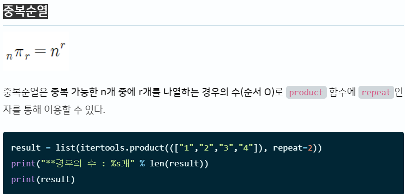
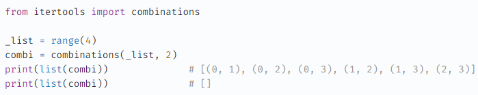
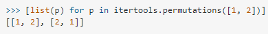

# [연산자 끼워 넣기](https://www.acmicpc.net/problem/14888)

## 문제 설명

* N개의 수로 이루어진 수열 A1, A2, ..., AN
* 수와 수 사이에 끼워 넣을 수 있는 N -1 개의 연산자 : + - x /
* 수와 수 사이에 연산자를 하나씩 넣어서 수식을 만든다. 단, 수의 순서를 바꿀 수 없다.
    * 식의 계산은 연산자의 우선순위를 무시하고 앞에서부터 진행한다.
    * 나눗셈은 몫만 취한다
        * 음수 / 양수 = 모두 양수로 바꾼뒤 나눗셈을 하고, 몫을 음수로 바꾼다.

* 예시
* 1,2,3,4,5,6

```
1+2+3-4×5÷6 = 1
1÷2+3+4-5×6 = 12
1+2÷3×4-5+6 = 5
1÷2×3-4+5+6 = 7
```

## 아이디어

* 수열 : 1 2 3 4 5 6 7

|인덱스|0|1|2|3|4|5|6|7|8|9|10|11|12|13|
|---|---|---|---|---|---|---|---|---|---|---|---|---|---|---|
|숫자|1| |2| |3| |4| |5| |6| |7|
|연산자| |v| |v| |v| |v| |v| |v|

* 수열 : 1 2 3 4 5 6 7 8 9 10

|인덱스|0|1|2|3|4|5|6|7|8|9|10|11|12|13|14|15|16|17|18|19|
|---|---|---|---|---|---|---|---|---|---|---|---|---|---|---|---|---|---|---|---|---|
|숫자|1| |2| |3| |4| |5| |6| |7| |8| |9| |10|
|연산자| |v| |v| |v| |v| |v| |v| |v| |v| |v|

* 숫자의 개수 : n(홀수, 짝수)
    * 수식을 담는 리스트의 길이 : 2n
    * 숫자의 인덱스 : 2(k-1). 단, 1<= k <= n
        * 즉, 2(k). 단, 0<= k <= n-1

    * 연산자의 인덱스 : 2j -1. 단, 1<= j <= n-1
        * 즉, 2j + 1. 단, 0<= j <= n-2


* 연산자를 지정할 때 순열을 사용한다.
    * [순열, 조합 공식](https://coding-factory.tistory.com/606)

> 1. 팩토리얼 ( n! )
>> 팩토리얼이란 서로 다른 n개를 나열하는 경우의 수를 의미합니다. 기호로는 n! 이렇게 쓰고 계산은 n부터 1씩 줄여나가면서 1이 될때까지의 모든 수를 곱합니다.
> 2. 순열 ( nPr )
>> 순열이란 서로 다른 n개중에 r개를 선택하는 경우의 수를 의미합니다. (순서 상관 있음)
> 3. 조합 ( nCr )
>> 조합이란 서로 다른 n개중에 r개를 선택하는 경우의 수를 의미합니다. (순서 상관 없음)
> 4. 중복 순열 ( nπr )
>> 중복 순열이란 중복 가능한 n개중에서 r개를 선택하는 경우의 수를 의미합니다. (순서 상관 있음)
> 5. 중복 조합 ( nHr )
>> 중복 조합이란 중복 가능한 n개중에서 r개를 선택하는 경우의 수를 의미합니다. (순서 상관 없음)

* [itertools 사용법](https://yganalyst.github.io/etc/memo_18_itertools/)



* [주의점](https://velog.io/@davkim1030/Python-%EC%88%9C%EC%97%B4-%EC%A1%B0%ED%95%A9-product-itertools)
    * combinations, permutations, product 세 메소드 모두 generator이기 때문에 list()로 캐스팅하여 다른 곳에 저장 해두지 않으면 한 번의 루핑 이후 사라지게 된다.

  

* [tuple형태 -> list형태](https://stackoverflow.com/questions/42625957/i-want-itertools-to-return-a-list-of-lists)
    * list(itertools.permutations([1, 2])) 는 [(1, 2), (2, 1)] 형태로 반환된다. [[1, 2], [2, 1]] 형태로 바꾸기 위해선

  


* [itertools 관련 파이썬 공식 문서](https://python.flowdas.com/library/itertools.html)
* [itertools 사용법2](https://hamait.tistory.com/803)

## 코드

### 1차시도(실패)

```python
import itertools

n = int(input())
algebra = [-1] * (2 * n)
num_list = list(map(int, input().split()))

# algebra 리스트의 인덱스가 짝수인 칸에 숫자를 넣는다
for i in range(n):
    algebra[2 * i] = num_list[i]

# add, sub, mul, div
num_operator = list(map(int, input().split()))
operator_list = []
for o in range(4):
    tmp_list = [o for _ in range(num_operator[o])]
    operator_list = list(itertools.chain(operator_list, tmp_list))

result_list = []

# 연산자는 (n-1)P(n-1) : 연산자 n-1 개중에서 n-1개를 선택하는 경우의 수
num_of_cases = [list(p) for p in itertools.permutations(operator_list, n - 1)]

for nc in num_of_cases:

    # algebra 리스트의 인덱스가 홀수인 칸에 연산자를 넣는다, 마지막 인덱스는 빈칸으로 남긴다.
    for i in range(n - 1):
        algebra[2 * i + 1] = nc[i]

    # 규칙에 맞게 계산
    result = algebra[0]
    for i in range(1, 2 * n, 2):
        # tmp_list 형식 : [연산자,숫자]
        tmp_list = algebra[i:i + 2]
        if tmp_list[0] == 0:
            result += tmp_list[1]
        elif tmp_list[0] == 1:
            result -= tmp_list[1]
        elif tmp_list[0] == 2:
            result *= tmp_list[1]
        elif tmp_list[0] == 3:
            result = abs(result) // tmp_list[1]
            if result < 0:
                result = (-1) * result
        elif tmp_list[0] == -1:
            break

    result_list.append(result)

print(max(result_list))
print(min(result_list))
```

---

### 2차시도([성공](https://www.acmicpc.net/status?from_problem=1&problem_id=14888))

```python
import itertools

n = int(input())
number_list = list(map(int, input().split()))

# add, sub, mul, div
num_operator = list(map(int, input().split()))

# 각 연산자의 개수만큼 연산자를 operator_list에 담는다
operator_list = []
for o in range(4):
    for _ in range(num_operator[o]):
        operator_list.append(o)

result_list = []

# 연산자는 (n-1)P(n-1) : 연산자 n-1 개중에서 n-1개를 선택하는 경우의 수
num_of_cases = [list(p) for p in itertools.permutations(operator_list, n - 1)]

min_val = int(1e9)
max_val = -int(1e9)

first = number_list.pop(0)
for nc in num_of_cases:
    result = first
    # 규칙에 맞게 계산
    for i in range(n - 1):
        if nc[i] == 0:
            result += number_list[i]
        elif nc[i] == 1:
            result -= number_list[i]
        elif nc[i] == 2:
            result *= number_list[i]
        elif nc[i] == 3:
            if result < 0:
                result = abs(result) // number_list[i]
                result = (-1) * result
            else:
                result = abs(result) // number_list[i]

    if result < min_val:
        min_val = result
    if result > max_val:
        max_val = result

print(max_val)
print(min_val)
```

* 설명예시

|인덱스|0|1|2|3|4|5|6|7|8|9|10|11|12|13|
|---|---|---|---|---|---|---|---|---|---|---|---|---|---|---|
|숫자|1| |2| |3| |4| |5| |6| |7|
|연산자| |v| |v| |v| |v| |v| |v|

---

* 코드설명

1.
```python
# add, sub, mul, div
num_operator = list(map(int, input().split()))

operator_list = []
for o in range(4):
    for _ in range(num_operator[o]):
        operator_list.append(o)
```

* num_operator에는 사칙연산자의 개수가 담겨있다.
    * num_operator == [1,3,3,4]라면
        * +(0)이 1개
        * -(1)이 3개
        * *(2)이 3개
        * /(3)이 4개

    * operator_list == [+,-,-,-,*,*,*,/,/,/,/] == [0,1,1,1,2,2,2,3,3,3,3] 

2.
```python
# 연산자는 (n-1)P(n-1) : 연산자 n-1 개중에서 n-1개를 선택하는 경우의 수
num_of_cases = [list(p) for p in itertools.permutations(operator_list, n - 1)]
```

* num_of_cases (경우의 수) 리스트에는 operator_list를 섞은 모든 경우가 담긴다.
    ```python
    input
    4
    1 5 3 7
    1 1 2 0
    
    number_list 
    [1, -1, 5, -1, 3, -1, 7, -1]
  
    operator_list 
    [0, 1, 2, 2]
    
    num_of_cases
    [[0, 1, 2], [0, 1, 2], [0, 2, 1], [0, 2, 2], [0, 2, 1], [0, 2, 2], 
     [1, 0, 2], [1, 0, 2], [1, 2, 0], [1, 2, 2], [1, 2, 0], [1, 2, 2], 
     [2, 0, 1], [2, 0, 2], [2, 1, 0], [2, 1, 2], [2, 2, 0], [2, 2, 1], 
     [2, 0, 1], [2, 0, 2], [2, 1, 0], [2, 1, 2], [2, 2, 0], [2, 2, 1]]
    ```

* operator_list 에서 0,1,2,2 의 의미
    * +,-,*,/ 의 개수가 각각 0개,1개,2개,2개


* num_of_cases 에서 0,1,2 의 의미
    * 0은 덧셈, 1은 뺼셈, 2는 곱셈, 3은 나눗셈

|인덱스|0|1|2|3|
|---|---|---|---|---|
|algebra|1|5|3|7|
|num_of_cases|0|1|2|


3.

```python
first = number_list.pop(0)
for nc in num_of_cases:
    result = first
    # 규칙에 맞게 계산
    for i in range(n - 1):
        if nc[i] == 0:
            result += number_list[i]
        elif nc[i] == 1:
            result -= number_list[i]
        elif nc[i] == 2:
            result *= number_list[i]
        elif nc[i] == 3:
            if result < 0:
                result = abs(result) // number_list[i]
                result = (-1) * result
            else:
                result = abs(result) // number_list[i]

    if result < min_val:
        min_val = result
    if result > max_val:
        max_val = result
```

* 예시

|인덱스|0|1|2|3|
|---|---|---|---|---|
|number_list|1|5|3|7|
|nc|0(+)|1(-)|2(*)|

| | |계산 |result|
|---|---|---|---|
| |first = number_list.pop(0) |1|1|
|nc[0] == 0(+)|number_list[0] == 5|1(result) + 5| 6|
|nc[1] == 1(-)|number_list[1] == 3|6(result) - 3| 3|
|nc[2] == 2(*)|number_list[2] == 7|3(result) * 7| 21|
---

* 틀린이유
    * [1차시도]

    ```python
    elif tmp_list[0] == 3:
    result = abs(result) // tmp_list[1]
    if result < 0:
        result = (-1) * result
    ```

    * [2차시도]

    ```python
    elif nc[i] == 3:
        if result < 0:
            result = abs(result) // number_list[i]
            result = (-1) * result
        else:
            result = abs(result) // number_list[i]
    ```

    * result의 부호를 먼저 확인한 뒤, 나누기를 해야한다.
        * 1차 시도에서 나누기를 한뒤, 부호확인을 했다.
        * 하지만, 나누기 과정에서 abs(result)에 의해 result는 양의 부호만 갖게 된다.


* dfs 없이 풀었기 때문에, 공간 & 시간복잡도가 처참하다.

---

### 개선된 알고리즘

```python
n = int(input())
nums = list(map(int, input().split()))
add, sub, mul, div = map(int, input().split())

min_val, max_val = int(1e9), -int(1e9)


def dfs(i, res, add, sub, mul, div):
    global min_val, max_val
    if i == n:
        max_val = max(res, max_val)
        min_val = min(res, min_val)
        return
    else:
        if add:
            dfs(i + 1, res + nums[i], add - 1, sub, mul, div)
        if sub:
            dfs(i + 1, res - nums[i], add, sub - 1, mul, div)
        if mul:
            dfs(i + 1, res * nums[i], add, sub, mul - 1, div)
        if div:
            dfs(i + 1, int(res / nums[i]), add, sub, mul, div - 1)


dfs(1, nums[0], add, sub, mul, div)
print(max_val)
print(min_val)
```

---

## [모범 답안](https://github.com/ndb796/python-for-coding-test/blob/master/13/5.py)

```python
n = int(input())
# 연산을 수행하고자 하는 수 리스트
data = list(map(int, input().split()))
# 더하기, 빼기, 곱하기, 나누기 연산자 개수
add, sub, mul, div = map(int, input().split())

# 최솟값과 최댓값 초기화
min_value = 1e9
max_value = -1e9


# 깊이 우선 탐색 (DFS) 메서드
def dfs(i, now):
    global min_value, max_value, add, sub, mul, div
    # 모든 연산자를 다 사용한 경우, 최솟값과 최댓값 업데이트
    if i == n:
        min_value = min(min_value, now)
        max_value = max(max_value, now)
    else:
        # 각 연산자에 대하여 재귀적으로 수행
        if add > 0:
            add -= 1
            dfs(i + 1, now + data[i])
            add += 1
        if sub > 0:
            sub -= 1
            dfs(i + 1, now - data[i])
            sub += 1
        if mul > 0:
            mul -= 1
            dfs(i + 1, now * data[i])
            mul += 1
        if div > 0:
            div -= 1
            dfs(i + 1, int(now / data[i]))  # 나눌 때는 나머지를 제거
            div += 1


# DFS 메서드 호출
dfs(1, data[0])

# 최댓값과 최솟값 차례대로 출력
print(max_value)
print(min_value)
```