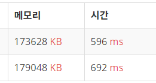

# [국영수](https://www.acmicpc.net/problem/10825)

## 문제 설명

## 아이디어

## 코드

### 1차시도 ([성공](https://www.acmicpc.net/status?user_id=guswns3371&problem_id=10825&from_mine=1))

```python
import sys

input = sys.stdin.readline

n = int(input())
score = []

for _ in range(n):
  name, kor, eng, math = input().split()
  score.append((name, kor, eng, math))

result = sorted(score, key=lambda x: (-int(x[1]), int(x[2]), -int(x[3]), x[0]))

for s in result:
  print(s[0])

```

* [파이썬 정렬, 다중 조건으로 한 번에 하기](https://dailyheumsi.tistory.com/67)

    

> c = sorted(a, key = lambda x : x[0])
 
* 하나의 인자를 기준으로 오름차순 정렬

> f = sorted(e, key = lambda x : (x[0], -x[1]))

* 0번쨰 인자를 기준으로 오름차순 정렬을 한다.
* 0번째 인자가 같다면, 1번째 인자를 기준으로 내림차순 정렬을 한다.

> result = sorted(score, key=lambda x: (-int(x[1]), int(x[2]), -int(x[3]), x[0]))

* 국어 점수가 감소하는 순서로 : -int(x[1])
* 국어 점수가 같으면 영어 점수가 증가하는 순서로 : int(x[2])
* 국어 점수와 영어 점수가 같으면 수학 점수가 감소하는 순서로 : -int(x[3])
* 모든 점수가 같으면 이름이 사전 순으로 증가하는 순서로 : x[0]


* input() vs sys.stdin.readline 속도차이 (위 : sys.stdin.readline, 아래 : input())

    

```python
import sys

input = sys.stdin.readline
```

* 애용하자
---

## [모범 답안](https://github.com/ndb796/python-for-coding-test/blob/master/14/1.py)

```python
n = int(input())
students = [] # 학생 정보를 담을 리스트

# 모든 학생 정보를 입력 받기
for _ in range(n):
    students.append(input().split())

'''
[ 정렬 기준 ]
1) 두 번째 원소를 기준으로 내림차순 정렬
2) 두 번째 원소가 같은 경우, 세 번째 원소를 기준으로 오름차순 정렬
3) 세 번째 원소가 같은 경우, 네 번째 원소를 기준으로 내림차순 정렬
4) 네 번째 원소가 같은 경우, 첫 번째 원소를 기준으로 오름차순 정렬
'''
students.sort(key=lambda x: (-int(x[1]), int(x[2]), -int(x[3]), x[0]))

# 정렬된 학생 정보에서 이름만 출력
for student in students:
    print(student[0])
```