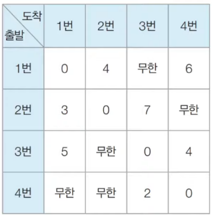
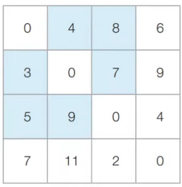

# 최단경로

# 가장 빠른 길 찾기

## 가장 빠르게 도달하는 방법

- 최단경로 : 가장 짧은 경로를 찾는 알고리즘

> 1. 다익스트라 최단 경로 알고리즘 ✔
>
> 2. 플로이드 워셜 ✔
> 3. 벨만 포드 알고리즘

## 다익스트라 최단 경로 알고리즘

- 그래프에서 여러개의 노드가 있을 떄, 특정한 노드에서 출발하여 다른 노드로 가는 각각의 최단 경로를 구하는 알고리즘

- **음의 간선**이 없을 때 정상적으로 동작
    - 음의 간선 : 0보다 작은 값을 갖는 간선
- 그리디 알고리즘의 한 종류 : 가장 비용이 적은 노드를 선택해서 임의의 과정을 반복하기 때문

### 다익스트라 최단 경로 알고리즘 원리

> 1. 출발 노드를 설정한다.
>
> 2. **최단 거리 테이블**을 초기화한다.
> 3. 방문하지 않은 노드중 최단 거리가 가장 짧은 노드를 선택한다.
> 4. 해당 노드를 거쳐 다른 노드로 가는 비용을 계산하여 최단 거리 테이블을 갱신한다.
> 5. 3,4번 과정을 반복한다.

- 각 노드에 대한 현재까지의 최단 거리 정보를 1차원 리스트 (최단 거리 테이블)에 저장한다.

- 매번 처리하고 있는 현재 노드를 기준으로 주변 간선을 확인한다.
    - 더 짧은 경로를 찾으면 => 갱신
- 방문하지 않은 노드 중 현재 최단 거리가 가장 짧은 노드를 확인해 => 4번 과정을 수행한다 (그리디 알고리즘)

### 다익스트라 알고리즘 구현 방법 2가지

> 1. 쉬운 구현 / 느린 동작 : O(V^2)
> 2. 까다로운 구현 / 빠른 동작 : O(E * logV)


#### 1. 간단한 다익스트라 알고리즘

- V : 노드의 개수

- 1차원 리스트 : 각 노드에 대한 최단거리를 담는다.
- 최단거리가 가장 짧은 노드를 선택하기위해 매 단계마다 1차원 리스트의 원소를 순차 탐색

```python
import sys

input = sys.stdin.readline
INF = int(1e9)

# 노드의 개수, 간선의 개수
n, m = map(int, input.split())
# 시작 노드 번호 입력받기
start = int(input())
# 각 노드에 연결되어 있는 노드에 대한 정보를 담는 1차원 리스트
graph = [[] for i in range(n + 1)]
# 방문한 적이 있는지 체크하는 목적의 리스트 
visited = [False] * (n + 1)
# 최단 거리 테이블을 모두 무한으로 초기화
distance = [INF] * (n + 1)

# 모든 간선 정보를 입력받기
for _ in range(m):
    # a번 노드에서 b번 노드로 가는 비용이 c
    a, b, c = map(int, input().split())
    graph[a].append((b, c))


# 방문하지 않은 노드 중 가장 최단 거리가 짧은 노드의 번호를 반환
def get_smallest_node():
    min_value = INF
    # 가장 최단 거리가 짧은 노드(인덱스)
    index = 0

    # 💥시간복잡도 omg
    for i in range(1, n + 1):
        if distance[i] < min_value and not visited[i]:
            min_value = distance[i]
            index = i
    return index


def dijkstra(start):
    # 시작 노드 초기화
    distance[start] = 0
    visited[start] = True

    # start번 노드에서 j[0]번 노드로 가는 비용 : j[1]
    for j in graph[start]:
        distance[j[0]] = j[1]

    for i in range(n - 1):
        now = get_smallest_node()
        visited[now] = True

        # 💥시간복잡도 omg
        # 현재 노드 now와 연결된 다른 노드 확인
        for j in graph[now]:
            # cost : 현재 노드now를 거쳐 다음 노드 j[1]으로 가는 거리
            cost = distance[now] + j[1]
            # distance[j[0]] : j[0]까지 가는 최단 거리
            if cost < distance[j[0]]:
                distance[j[0]] = cost


dijkstra(start)

```

#### 2. 개선된 다익스트라 알고리즘

- V : 노드의 개수
  
- E : 간선의 개수
- 최단 거리가 가장 짧은 노드를 찾는 방법 : Heap 자료구조 사용
- **Heap**

> - 우선순위 큐 구현에 사용되는 자료구조
>   - 우선순위 큐 : 우선순위가 가장 높은 데이터를 가장 먼저 삭제
> - 파이썬에서 *PriorityQueue* 또는 ***heapq*** 라이브러리를 사용
>   - **heapq** : 튜플을 원소로 받으면, 튜플의 첫번쨰 원소를 기준으로 우선순위 큐를 구성한다.
> - 최소힙(Min Heap) : 값이 낮은 데이터가 먼저 삭제됨 
>   - ✅파이썬에서 기본적으로 최소 힙 구조를 이용
>   - 다익스트라 최단 경로 알고리즘 : 비용이 적은 노드를 우선탐색하므로, 최소 힙 구조가 적합하다
> - 최대힙(Max Heap) : 값이 큰 데이터가 먼저 삭제됨
>   - 최소힙을 최대힙처럼 사용하는 방법 : 우선순위 값에 음의 부호를 붙혀 넣고, 꺼낸 뒤 다시 음의 부호를 붙여 원래의 값으로 돌린다.
> - 우선순위 큐 구현방식

|우선순위 큐 구현 방식|삽입시간|삭제시간|
|----|----|----|
|리스트|O(1)|O(N)|
|힙|O(logN)|O(logN)|

- 다익스트라 알고리즘에서의 우선순위 큐 : 현재 가장 가까운 노드를 저장하기 위한 목적
  
  - 가장 가까운 노드 = 우선순위 큐에서 그냥 pop 한 노드
  
  - 최단 거리가 가장 짧은 노드를 탐색하는 과정이 필요 없어진다
  - get_smallest_node() 함수가 필요 없다
  
```python
import heapq
import sys

input = sys.stdin.readline
INF = int(1e9)

n,m = map(int, input().split())
start = int(input())

graph = [[] for i in range(n+1)]

distance = [INF] * (n+1)

for _ in range(m):
    a,b,c = map(int,input().split())
    graph[a].append((b,c))

def dijkstra(start):
    q = []
    heapq.heappush(q,(0,start))
    distance[start] = 0
    
    while q:
        dist, now = heapq.heappop(q)
        if dist > distance[now]:
            continue
    
        for i in graph[now]:
            cost = dist + i[1]
            if distance[i[0]] > cost:
                distance[i[0]] = cost
                heapq.heappush(q,(cost, i[0]))

dijkstra(start)
```


## 플로이드 워셜 알고리즘

- 모든 지점에서 다른 모든 지점까지의 최단 경로를 모두 구하는 알고리즘 : O(N^3)

- 다익스트라 알고리즘 vs 플로이드 워셜 알고리즘
  - 다익스트라
  >  - 단계마다 최단 거리를 가지는 노드를 하나씩 반복적으로 선택
  >  - 해당 노드를 거쳐가는 경로를 확인 후
  >  - 최단 거리 테이블을 갱신
  >  - 그리디 알고리즘

  - 플로이드 워셜
  >  - 거쳐가는 노드를 기준으로 알고리즘 수행
  >  - 매번 방문하지 않은 노드 중에서 최단 거리를 찾을 필요가 없다 ✅ 
  >  - 다이나믹 프로그래밍 => **점화식**
  >    - Dab = min(Dab, Dak + Dkb)
  
  | Dab                        | Dak + Dkb                       |
  | -------------------------- | ------------------------------- |
  | (A -> B) 로 가는 최소 비용 | (A -> K -> B) 로 가는 최소 비용 |

- 그림
  
  
  
```python
INF = int(1e9)

# 노드 개수 & 간선 개수
n = int(input())
m = int(input())

# 2차원 리스트(그래프 표현)
graph = [[INF]*(n+1) for _ in range(n+1)]

# 자기 자신으로 가는 경로 비용 = 0
for a in range(n+1):
    for b in range(n+1):
        if a==b:
            graph[a][b]=0

# 각 간선에 대한 정보 입력
for _ in range(m):
    a,b,c = map(int,input().split())
    graph[a][b] = c

# 점화식에 따라 플로이드 워셜 알고리즘 수행
for k in range(1, n+1):
    for a in range(1,n+1):
        for b in range(1,n+1):
            # 점화식 그대로
            graph[a][b] = min(graph[a][b], graph[a][k] + graph[k][b])
```